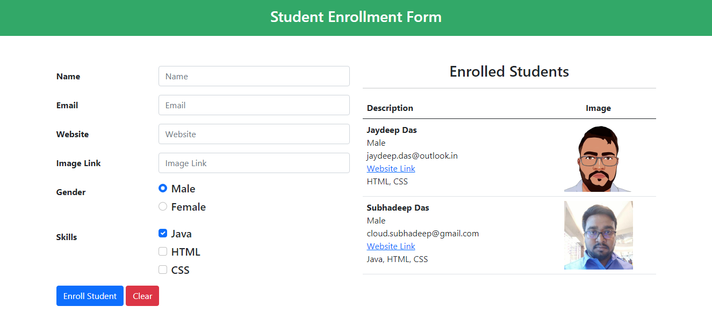

# Student Enrollment Form

Here you can easily store student information and show in tabular form

## language required
 - HTML5
 - CSS3
 - Javascript

I also use Bootstrap. Bootstrap is a free and open-source CSS framework directed at responsive, mobile-first front-end web development. It contains CSS- and JavaScript-based design templates for typography, forms, buttons, navigation, and other interface components.

